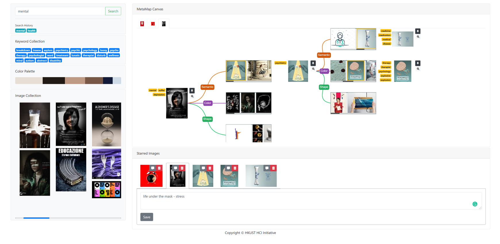

## MetaMap
> Supporting Visual Metaphor Ideation through Multi-dimensional Example-based Exploration

Youwen Kang*, Zhida Sun*, Sitong Wang, Zeyu Huang, Ziming Wu, and Xiaojuan Ma. 2021. MetaMap: Supporting Visual Metaphor Ideation through Multi-dimensional Example-based Exploration. In Proceedings of the 2021 CHI Conference on Human Factors in Computing Systems (CHI '21). Association for Computing Machinery, New York, NY, USA, Article 427, 1–15. [DOI:https://doi.org/10.1145/3411764.3445325](https://doi.org/10.1145/3411764.3445325)



### Run

* Download the source code, the database and the images *from [release](https://github.com/sunzhida/projects_MetaBoard_system/releases/latest)*. (Cloning the project is not advised, as historical git snapshots contain a huge image database. However, downloading from the release will not have this issue.) (No kidding, the entire image database is ~2.5G.)
* Put `database.db` at project root, and extract the `img` folder to `<project>/app/static/`.
The final structure looks like

```
<project>
├─run.py
├─database.db
├─app
│  ├─static
│  │  ├─img
│  │  │  └─*.{jpg|png}
│  │  └─...
│  └─...
└─...
```

* Install the dependencies. Each dependency is explicitly imported at the top of `app/run.py`. You can install them manually.
As a `conda` alternate, you can run `conda env create -f environment.yml` in the project root directory to create an environment named *metamap*
with required dependencies.
* `cd` to the project root and run `python run.py`. The webapp will be hosted on 5000 by default.

### Note

Start by entering search keywords on the top left.
Available keywords including *bike*, *mental*, *clock*...
More possible keywords will show up beneath the input area after clicking the search button.
Clicking on any color on the palette will sort images in that order.

Clicking an image on the bottom left will put it to the main canvas.
Click on it on the main canvas to expand operations.
Clicking on the tag on its left to "explore".
(There is still room for optimizations.
Please bear with slow responses if the exploration results
do not show up after 6+ seconds. They will eventually show up if you have clicked once.)

On the right three carousels will appear.
Hover on them and use the arrow buttons to navigate.
Alternatively, drag or click on the horizontal scroll bar to navigate.
Click on an image to select and show its keywords.
Click on any keywords to further explore from it.

### Functions

#### Left control panel

1. Searching (done)
    1. searching keywords with keywords
    2. searching images with keywords
2. Keywords history
3. Color palette

#### Right mood-boarding area

1. Expand/Explore the mind map
    1. searching images with images
    2. searching keywords with images
2. Interaction history


